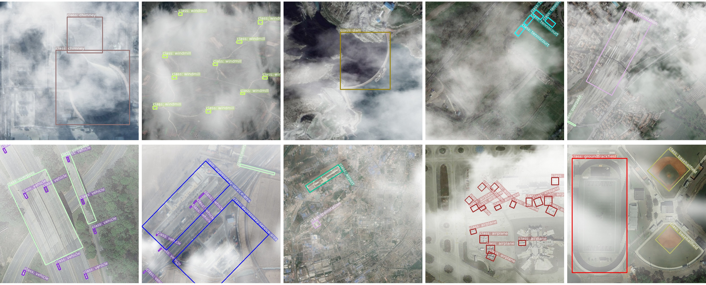

<p align="center">
  <h1 align="center">✨<font color="#640D5F", face=Cooper Black>NIRNet</font>✨
</h1>
</p>

## Introduction

This is official implementation of NIRNet, which is implemented on [MMRotate](https://github.com/open-mmlab/mmrotate).

Note: We will be updating the code in the near future.

## Hazy-DIOR

Some examples of the Hazy-DIOR dataset. The entire dataset will be released in the near future.



## Install 

Please refer to the [markdown](./docs/install.md) for installation and dataset preparation.

## Get Started

**train**

```
cd nirnet
python tools/train.py ./config/nirnet_r50_1x_dior_le135.py
```

**test**

```
cd nirnet
python tools/test.py ${CONFIG_FILE} ${CHECKPOINT_FILE} [optional arguments]
```